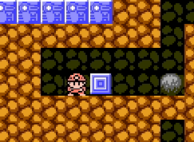
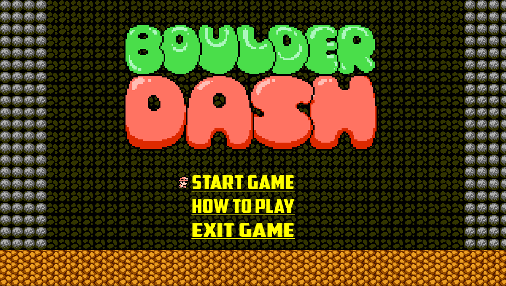
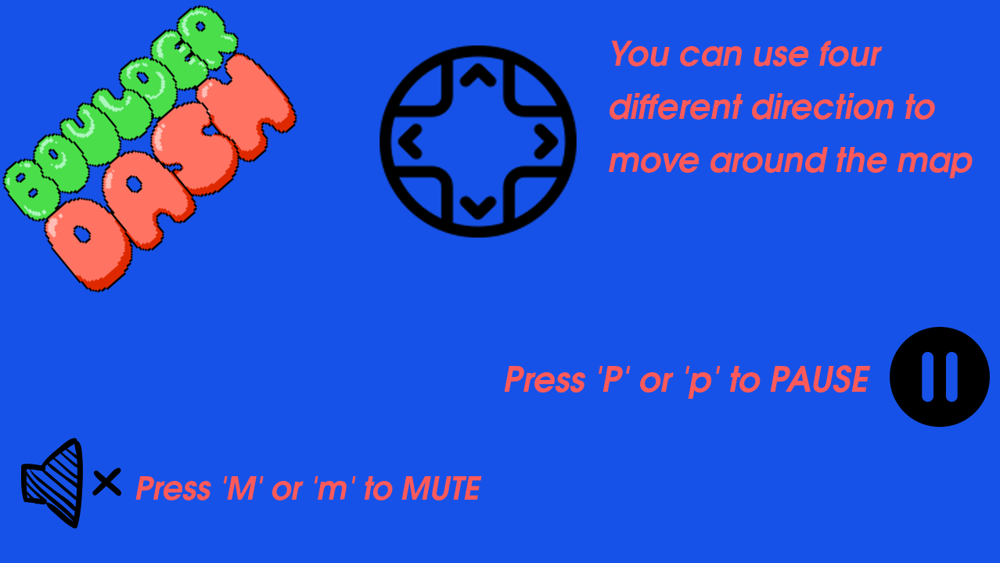

# Boulder-Dash

## Game History

Boulder Dash, is a video game released in 1984 by First Star Software for Atari 8-bit computers.There have been numerous versions and sequels in this series for numerous interactive platforms including: Apple II, MSX, ZX Spectrum, Commodore 64, ColecoVision, NES, BBC Micro, Acorn Electron, IBM PC, Amstrad CPC, Amiga, Mac OS, and other platforms. It also influenced other games in the rocks-and-diamonds genre such as Repton in addition to rather direct clones such as Emerald Mine. The original Boulder Dash was created by Canadian developers Peter Liepa and Chris Gray, and on October 28, 1983, acquired by First Star Software, which still owns the rights to the game and the intellectual property, including the registered trademark: "Boulder Dash".
- Reference : [wikipedia](https://en.wikipedia.org/wiki/Boulder_Dash)

<center>


</center>

- **Project Purpose**

The aim of the project was to create a replica game, as shown in pdf, rather than creating a new game.For this reason, I did not have to be very creative, but during the development phase, I encountered many tricky problems related to game dynamics.

- **Challenges :**
  - It was my first complex project so I did not actually know what I'm going to do as next at the beginning. Resourcing about game develoment was a good solution.I  probed a lot of things related to [SDL](https://www.libsdl.org/)  that will be explained in below.I will attach some links that i find out during that process.

  - Code structure was so crucial at first , because there are lots properties related to character , background audio , tiles which are rendered to the screen .I even did not find any sprite-sheet about boulder dash at first. I did not know object-oriented-programming while joining the parts of project. Exploiting struct data type was a good idea. I implemented unique structure for each seperated part of the game.

<center>
    
    
</center>

- **Why did you use ```extern``` every single header ?**

Actually all functions are extern as default but in my design structure I have .c and .h files for each seperate unit.There should be a communication between different compilation unit on structure design. Extern actually does that.

More info about ```extern``` : [1](https://jameshfisher.com/2017/08/28/c-extern-function/) , [2](https://www.tutorialspoint.com/extern-keyword-in-c) , [3](https://stackoverflow.com/questions/1041866/what-is-the-effect-of-extern-c-in-c)
<center>
    
</center>

- **SDL - Simple DirectMedia Layer**

    Simple DirectMedia Layer is a cross-platform development library designed to provide low level access to audio, keyboard, mouse, joystick, and graphics hardware via OpenGL and Direct3D.

    SDL is written in C, works natively with C++, and there are [bindings available](https://www.libsdl.org/languages.php) for several other languages, including C# and Python. 

    __Official Wepsite__ : [Simple DirectMedia Layer](https://www.libsdl.org/)

- #### Gameplay

    <center>
    
    </center>

- **Dependency**

There are three different library in addition to pure [SDL](https://www.libsdl.org/).

    - [SDL_ttf](https://www.libsdl.org/projects/SDL_ttf/)
      - It is an text file loading library.  
    
    - [SDL_mixer](https://www.libsdl.org/projects/SDL_mixer/)
      - It is an audio file loading library.
    
    - [SDL_image](https://www.libsdl.org/projects/SDL_image/)
      - It is an image file loading library.
  
- **Installation**
    
    1 - Install indicated libraries that are above and also SDL itself.
    
    2 - Type ```make``` on shell environment , it will be create executable file which's name ```game```.
    
    3 - Run the executable ```./game```.

- **Other projects that's created thanks to SDL**
   - [Quick-Dick](https://github.com/nevzatseferoglu/Quick-Dict)
